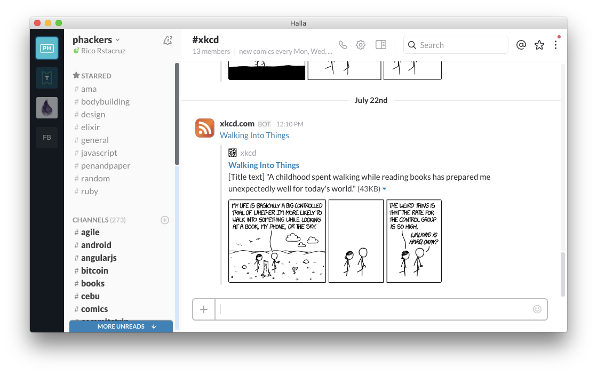

# Halla

> Native Slack wrapper app without the bloat



Halla is yet another "native" app for accessing your Slack teams. It tries to be more conservative with resources. Halla is built on [nw.js], which takes less resources than [Electron][] (most other wrapper apps) or [MacGap][] (Slack official app).

**[Download Halla →](https://github.com/rstacruz/halla/releases)**

[](https://travis-ci.org/rstacruz/halla "See test builds")

[nw.js]: http://nwjs.io/
[Electron]: http://electron.atom.io/
[MacGap]: https://macgapproject.github.io/

## Config

Create a file called `~/.hallarc`. You may add as many Slack teams here, as well as any arbitrary URLs.

```dosini
[services.myteam]
name = My Slack
url = https://myteam.slack.com

[services.otherteam]
name = Their Slack
url = https://otherteam.slack.com

[services.facebook]
name = Messenger
url = https://messenger.com
```

You may add any URL (!), but only certain sites get extra features (eg, Slack team icons and badge notifications).

## Developer setup

<details>
<summary>*Show developer info...*</summary>

### Under the hood

- [nw.js](http://nwjs.io/) for the native wrapping
- [nwjs-builder](https://www.npmjs.com/package/nwjs-builder) to simplify management of different nw.js versions
- [Decca](https://ricostacruz.com/decca) for virtual DOM
- [Brunch.io](http://brunch.io/) + Sass + Autoprefixer for CSS

A few notes on how it's put together:

- There's no JS transpilation. This means no JSX (a bit painful, but you'll get used to it!).
- No Gulp, Grunt or whatnot--just plain npm scripts with [npm-run-all](https://www.npmjs.com/package/npm-run-all).
- nw.js is in `--mixed-context` mode to make things a bit simpler.

### Starting up

```sh
git clone https://github.com/rstacruz/halla.git
cd halla
npm install
```

### Running

Run it with `npm start`. Note that it'll download nw.js on its first run (pretty big).

```sh
npm start
```

Or run it with the SDK (more resource-intensive, but has *Inspect Element*):

```sh
npm run start:sdk
```

### Testing

```sh
npm test
```

### Packaging

This will create OSX `.app` files in `/dist`. This is automatically done by Travis on every new version (ie, new git tags).

```sh
npm run dist
```

</details>

## Limitations

Most everything you expect will work, except for a few things:

- Slack sounds (help me find out why!)
- Native notifications (they'll use Rich Chrome Notifications instead)
- Flash (ie, Spotify/Soundcloud won't work)
- Skype plugin (Skype works, but no calls)

## Alternatives

Here are some more feature-rich alternatives to Halla:

- [Franz](http://www.meetfranz.com/)
- [Rambox](http://rambox.pro/)

## Thanks

**halla** © 2016+, Rico Sta. Cruz. Released under the [MIT] License.<br>
Authored and maintained by Rico Sta. Cruz with help from contributors ([list][contributors]).

> [ricostacruz.com](http://ricostacruz.com) &nbsp;&middot;&nbsp;
> GitHub [@rstacruz](https://github.com/rstacruz) &nbsp;&middot;&nbsp;
> Twitter [@rstacruz](https://twitter.com/rstacruz)

[MIT]: http://mit-license.org/
[contributors]: http://github.com/rstacruz/halla/contributors
